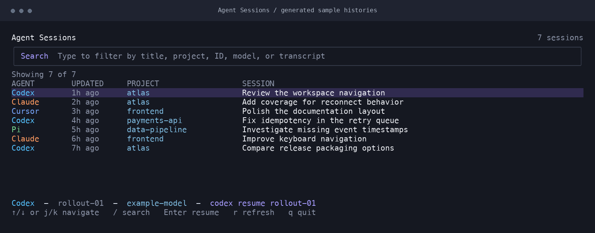

<p align="center">
  <picture>
    <source media="(prefers-color-scheme: dark)" srcset="docs/assets/brand/wordmark-dark.png">
    
  </picture>
</p>

<p align="center">Your coding sessions, back within reach.</p>

[](https://github.com/natelindev/agent-sessions-tui/actions/workflows/ci.yml)
[Documentation](https://natelindev-agent-sessions-tui.pages.dev/) · [Contributing](CONTRIBUTING.md) · [Report a bug](https://github.com/natelindev/agent-sessions-tui/issues/new/choose)

`agent-sessions-tui` is a focused terminal browser for local coding-agent sessions. It discovers histories from supported tools, keeps filtering immediate, and resumes the selected CLI session in the current terminal.

<p align="center">
  
</p>

<p align="center"><em>Actual PTY output using generated session fixtures; no personal histories are shown.</em></p>

It is intentionally limited to three jobs:

- Discover and normalize local agent sessions.
- Search and navigate them quickly with a keyboard or mouse.
- Resume supported sessions without copying IDs or commands by hand.

Session data stays local and provider stores are opened read-only. To keep later launches fast, the app stores a private incremental search cache in the operating system's user cache directory. The cache contains metadata and searchable transcript terms; treat it as private. Later launches render that snapshot first, then validate it in the background. Unchanged transcripts are reused based on their path, size, and modification time; changed and removed files are updated automatically.

## Supported tools

| Tool | Default local store | Resume |
| --- | --- | --- |
| Codex | `~/.codex/sessions`, `~/.codex/archived_sessions` | `codex resume <id>` |
| Claude | `~/.claude*/projects`, `~/.claude*/transcripts`, Claude desktop local sessions | `claude --resume <id>` |
| Antigravity | `~/.gemini/antigravity*/brain` | `agy --conversation <id>` |
| OpenCode | `~/.local/share/opencode/opencode.db` and legacy JSON storage | `opencode --session <id>` |
| Hermes | `~/.hermes/state.db` and `~/.hermes/sessions` | `hermes --resume <id>` |
| GitHub Copilot CLI | `~/.copilot/session-state` | `copilot --resume=<id>` |
| Droid | `~/.factory/sessions`, `~/.factory/projects` | Not exposed because the source app has no stable ID resume workflow |
| OpenClaw | `~/.openclaw/agents`, legacy `~/.clawdbot/agents` | Not exposed because the source app has no stable ID resume workflow |
| Cursor Agent | `~/.cursor/projects/*/agent-transcripts` | `cursor agent --resume <id>` |
| Pi | `~/.pi/agent/sessions` | `pi --session <path-or-id>` |

The app respects `OPENCLAW_STATE_DIR` when it is set.

## Appearance

Each provider has a distinct color, while timestamps, projects, titles, search state, and the active row use separate visual weights. The adaptive palette is designed for light and dark terminals. Standard `NO_COLOR` behavior is respected.

## Install

Go 1.24 or newer is required.

Install directly with Go:

```sh
go install github.com/natelindev/agent-sessions-tui/cmd/agent-sessions-tui@latest
```

For a local checkout:

```sh
./scripts/install.sh
agent-sessions-tui
```

The checkout installer builds the source and installs atomically into `$XDG_BIN_HOME` or `~/.local/bin`. Override the destination when needed:

```sh
./scripts/install.sh --bin-dir /usr/local/bin
```

## Command line

```sh
agent-sessions-tui --home /path/to/example-home
agent-sessions-tui --version
agent-sessions-tui --help
```

`--home` selects the home containing provider stores. The default is your OS home directory. Provider CLIs must be installed and authenticated separately to resume work.

## Controls

| Action | Keyboard | Mouse |
| --- | --- | --- |
| Navigate | Arrow keys, `j` / `k`, Page Up / Page Down | Scroll wheel |
| Search | `/`, then type | Click the search field, then type |
| Leave search | Enter or Escape | Click a row |
| Clear search | Escape outside the search field | - |
| Resume | Enter | Double-click a row |
| Refresh | `r` | - |
| Quit | `q` or Ctrl+C | - |

Search is case-insensitive and updates on every keystroke. Space-separated terms use AND matching across provider, session ID, title, project, working directory, model, path, and indexed transcript text. File-backed sessions scan the complete transcript and deduplicate normalized search terms, so later messages remain searchable without retaining repeated text. OpenCode and Hermes database rows use their session metadata.

## Design

The implementation has four small layers:

- `internal/discovery` locates provider stores, incrementally caches file-backed search indexes, and extracts lightweight session records concurrently.
- `internal/session` owns the normalized model, sorting, and in-memory search.
- `internal/resume` maps supported providers to argument-safe `exec.Cmd` values.
- `internal/ui` owns the responsive Bubble Tea interface and input handling.

Resume commands are built as executable paths plus argument arrays. They are not passed through a shell. The selected working directory is used when it still exists, and Bubble Tea temporarily hands the terminal to the resumed process.

## Inspiration and scope

This is an independent Go TUI inspired by [Agent Sessions](https://github.com/jazzyalex/agent-sessions), a local-first desktop app for browsing work across coding agents. It carries forward the original project's most useful core workflow: discover sessions across tools, search them instantly, and resume work with minimal friction.

The scope is deliberately smaller. It does not include transcript and image viewers, usage quotas, analytics, saved-session management, settings screens, menu-bar features, or an application updater. The result is a fast terminal-native tool centered on session discovery, search, and resume.

## Development

```sh
go test ./...
go vet ./...
go build -trimpath -o ./bin/agent-sessions-tui ./cmd/agent-sessions-tui
```

The project uses Bubble Tea and Lip Gloss for terminal rendering and the pure-Go `modernc.org/sqlite` driver for read-only OpenCode and Hermes access.

## Documentation

The [documentation site](https://natelindev-agent-sessions-tui.pages.dev/) covers provider stores, controls, search semantics, cache locations, resume behavior, and troubleshooting. It is a static site in `docs/`, hosted on Cloudflare Pages. [Publishing instructions](CONTRIBUTING.md#documentation-site) and [brand assets](docs/assets/brand/README.md) are included.

## License

Released under the [MIT License](LICENSE).
